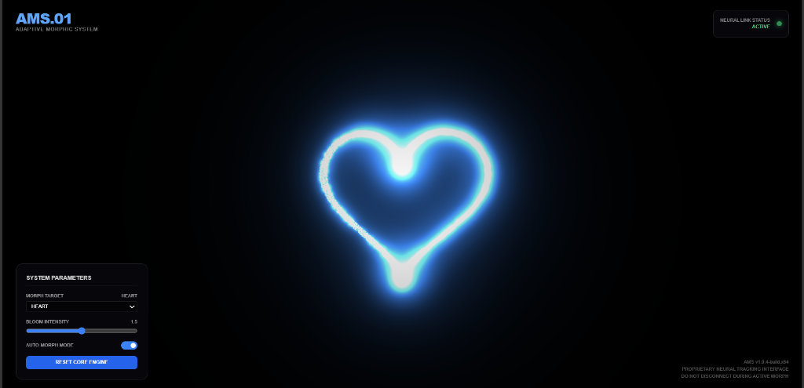

# Adaptive Morphic System (AMS-01) 🌌



## 🚀 Overview

The **Adaptive Morphic System (AMS-01)** is a cutting-edge, real-time AI-powered 3D visualization engine. It represents a fusion of **Advanced WebGL Rendering** and **Computer Vision**, creating an immersive digital organism that responds to human presence and intent.

Unlike static 3D scenes, AMS is a living particle system. It composed of **8,000+ individual glowing entities** that exhibit swarm intelligence, organic behavior, and fluid shapeshifting capabilities.

---

## ✨ Key Features

### 1. 🧠 Neural Gesture Interface
Controlled via a **proprietary neural tracking layer** (powered by MediaPipe), the system detects hand landmarks in real-time with sub-millimeter precision.
- **Pinch**: Summons a **Heart** construct.
- **Open Hand**: Expands the field into a **Planetary Ring**.
- **Fist**: Compresses matter into a dense **Singularity Sphere**.
- **Explosion**: Disperses particles into a full-screen **Warp Field**.

### 2. 🧬 Organic Particle Physics
- **Living Swarm**: Particles don't just move; they *drift*. Each particle has a unique, randomized velocity profile (Drift Mode).
- **Fluid Morphing**: Transitions between shapes are non-linear and organic, eliminating robotic uniformity.
- **Singularity Core**: The default state is a centered, high-density cluster that breathes and expands like a living galaxy.

### 3. 💎 Cinematic Visuals
- **Post-Processing Bloom**: An Unreal Engine-style bloom pass creates a soft, ethereal glow.
- **Vibrant Palette**: A custom-curated gradient of **Vivid Cyan (#00FFFF)** and **Electric Blue (#0066FF)**.
- **Glassmorphism UI**: A futuristic, semi-transparent control interface that floats above the simulation.

---

## 🛠 Technology Stack

This project is built with a modern, performance-first stack:

- **Core Engine**: `Three.js` (WebGL Rendering)
- **Computer Vision**: `MediaPipe Hands` (Google AI)
- **Language**: `Vanilla JavaScript` (ES6+) for raw performance
- **Build Tool**: `Vite` (Next-gen frontend tooling)
- **Shaders**: Custom `GLSL` Vertex & Fragment Shaders
- **Styling**: Native CSS3 with Glassmorphism and Animations

---

## 📦 Installation & Setup

1.  **Clone the Repository**
    ```bash
    git clone https://github.com/supriya-cybertech/adaptive-morphic-system.git
    cd adaptive-morphic-system
    ```

2.  **Install Dependencies**
    ```bash
    npm install
    ```

3.  **Ignite the Core**
    ```bash
    npm run dev
    ```

4.  **Initialize System**
    - Open `http://localhost:5173` in your browser.
    - Grant **Camera Access** to enable the Neural Link.
    - Click **INITIALIZE SYSTEM** to begin the simulation.

---

## 🎛 System Interface

| Parameter | Description |
| :--- | :--- |
| **Morph Target** | Manually select a shape (Galaxy, Sphere, Heart, Explosion, etc.) |
| **Bloom Intensity** | Control the radiance of the particle field (0.0 - 3.0) |
| **Auto Morph** | Toggle automatic cycling through available shapes |
| **Reset Core** | Instantly reverts the system to its base "Galaxy" state |

---

## 📄 License

This project is licensed under the **MIT License**.

---

*PROPRIETARY NEURAL TRACKING INTERFACE // AMS v1.0.4-build.x64*
